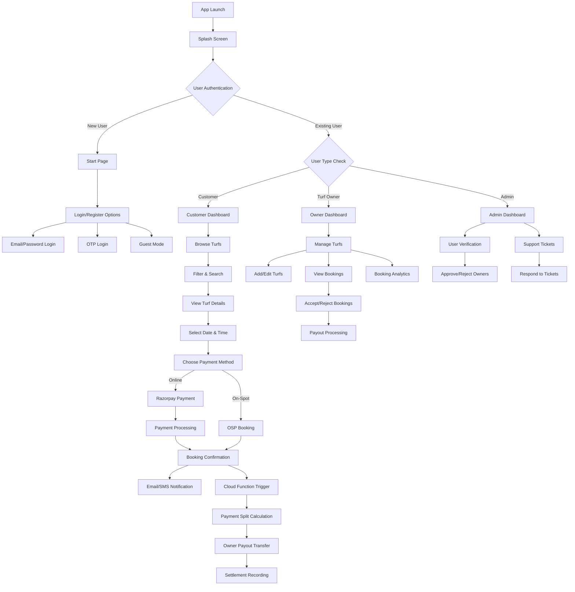
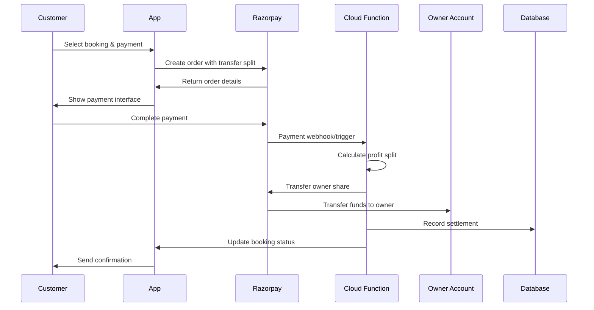
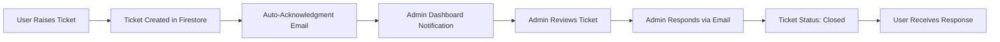
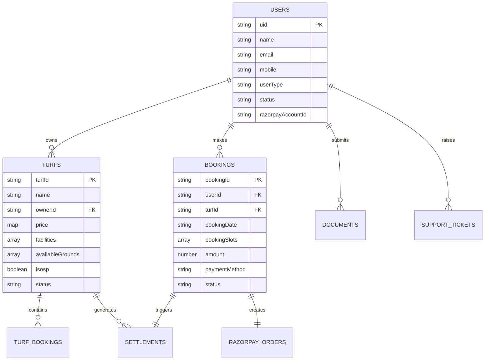
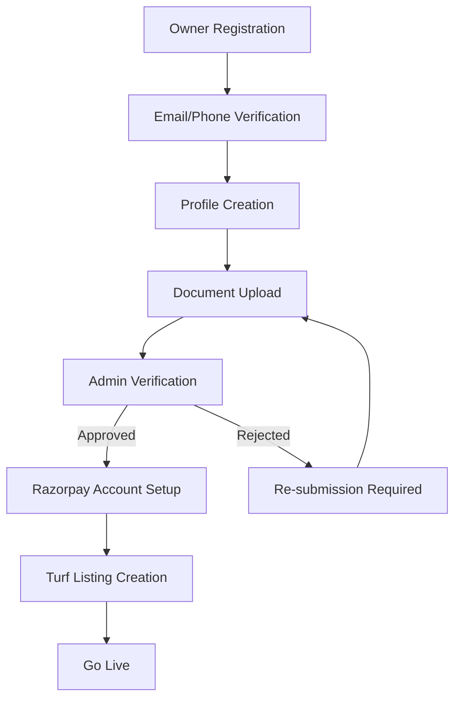
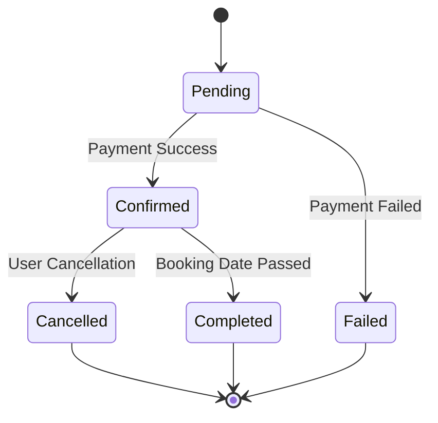

# BookTheBiz 🏟️

<div align="center">
  
  
  **A Complete Turf Booking Management System**
  
  [](https://play.google.com/store)
  [](https://flutter.dev)
  [](https://firebase.google.com)
  [](https://play.google.com/store)
</div>

---

## 🏢 Company Information

**Developed by:** [Punchbiz](https://punchbiz.com)  
**Lead Developer:** Mohamed Athik R (App Developer)  
**Current Version:** 20 (Live on Google Play Store)  
**Platform:** Flutter (Android & iOS)

---

## 📱 Application Overview

BookTheBiz is a comprehensive turf booking management system that connects turf owners with customers, providing a seamless platform for sports facility reservations. The application supports multiple user roles, real-time booking management, integrated payment processing, and automated business operations.

---

## 🎯 System Architecture & Flow

### 📊 Application Flow Diagram



### 🔄 Complete System Flow

#### 1. **Application Initialization**
```
App Launch → Firebase Initialization → Authentication Check → Role-based Routing
```

#### 2. **User Registration Flow**
```
Start Page → Register → Email/Mobile Verification → OTP Verification → Profile Creation → Role Assignment
```

#### 3. **Booking Flow (Customer)**
```
Browse Turfs → Apply Filters → Select Turf → View Details → Choose Date/Time → 
Select Ground → Payment Method → Process Payment → Booking Confirmation → 
Email/SMS Notification → Cloud Function Trigger → Payment Split
```

#### 4. **Turf Management Flow (Owner)**
```
Owner Dashboard → Add Turf → Upload Images → Set Pricing → Define Availability → 
Account Verification → Receive Bookings → Manage Bookings → Receive Payouts
```

#### 5. **Admin Management Flow**
```
Admin Login → User Verification → Document Review → Approve/Reject → 
Support Ticket Management → System Monitoring
```

---

## 👥 User Roles & Permissions

### 🔵 **Customer (User)**
- **Capabilities:**
  - Browse and search turfs
  - Filter by location, sports type, price
  - View detailed turf information
  - Book turfs with date/time selection
  - Make online payments via Razorpay
  - Opt for On-Spot Payment (if enabled)
  - View booking history
  - Cancel bookings (8+ hours in advance)
  - Raise support tickets
  - Manage profile

### 🟢 **Turf Owner**
- **Capabilities:**
  - Add and manage multiple turfs
  - Upload turf images with spotlight image
  - Set dynamic pricing per ground type
  - Define available time slots
  - Enable/disable On-Spot Payment
  - View real-time booking analytics
  - Manage booking requests
  - Receive automated payouts
  - Track settlement history
  - Update turf status (Open/Closed)

### 🔴 **Admin**
- **Capabilities:**
  - Verify turf owner documents (Aadhaar, PAN, GST)
  - Approve/reject owner registrations
  - Manage support ticket system
  - Monitor platform transactions
  - Access user management tools
  - System-wide oversight

---

## 🏗️ Database Schema

### 📋 **Firestore Collections Structure**

#### **Users Collection**
```javascript
users/{userId} {
  uid: string,
  name: string,
  email: string,
  mobile: string,
  userType: "User" | "Turf Owner" | "adminuser",
  status: "yes" | "Not Confirmed" | "Disagree",
  imageUrl?: string,
  razorpayAccountId?: string, // For turf owners
  createdAt: timestamp,
  verifiedby?: {
    id: string,
    name: string,
    mobile: string
  }
}
```

#### **Turfs Collection**
```javascript
turfs/{turfId} {
  turfId: string,
  name: string,
  description: string,
  price: Map<string, number>, // Ground type -> price mapping
  imageUrl: string, // Spotlight image
  turfimages: string[], // Additional images
  facilities: string[],
  availableGrounds: string[],
  selectedSlots: string[],
  ownerId: string,
  location: string,
  latitude?: number,
  longitude?: number,
  status: "Open" | "Closed",
  isosp: boolean, // On-Spot Payment enabled
  hasLocation: boolean
}
```

#### **Bookings Collection**
```javascript
bookings/{bookingId} {
  userId: string,
  userName: string,
  turfId: string,
  turfName: string,
  bookingDate: string, // YYYY-MM-DD
  bookingSlots: string[],
  bookingStatus: string[], // Cancelled slots
  selectedGround: string,
  amount: number,
  totalHours: number,
  paymentMethod: "Online" | "On Spot Payment",
  status: "confirmed" | "pending" | "cancelled",
  razorpayPaymentId?: string,
  razorpayOrderId?: string,
  payoutStatus?: "pending" | "settled" | "failed",
  createdAt: timestamp
}
```

#### **Turf Bookings Sub-collection**
```javascript
turfs/{turfId}/bookings/{bookingId} {
  // Same structure as main bookings collection
  // Used for turf-specific booking queries
}
```

#### **Documents Collection** (Owner Verification)
```javascript
documents/{userId} {
  userId: string,
  aadhar: string, // Base64 encoded
  pan: string, // Base64 encoded
  gst?: string // Optional GST number
}
```

#### **Support Tickets Collection**
```javascript
support_tickets/{ticketId} {
  userId: string,
  userEmail: string,
  subject: string,
  message: string,
  status: "open" | "Closed",
  adminResponse?: string,
  createdAt: timestamp,
  respondedAt?: timestamp
}
```

#### **Settlement Tracking Collections**
```javascript
booking_settlements/{bookingId} {
  booking_id: string,
  turf_id: string,
  total_paid: number,
  owner_share: number,
  platform_profit: number,
  razorpay_payment_id: string,
  owner_account_id: string,
  settledAt: timestamp
}

razorpay_orders/{orderId} {
  booking_id: string,
  turf_id: string,
  total_paid: number,
  owner_share: number,
  platform_profit: number,
  razorpay_order_id: string,
  owner_account_id: string,
  createdAt: timestamp
}
```

---

## 💳 Payment System Architecture

### 🔄 **Payment Flow Diagram**



### 💰 **Payment Split Logic**

The application implements a sophisticated payment splitting system:

#### **Profit Calculation Slabs:**
- **< ₹1000:** 15% platform profit
- **₹1000-₹3000:** Fixed ₹110 platform profit  
- **> ₹3000:** Fixed ₹210 platform profit

#### **Fee Structure:**
- **Razorpay Fee:** 2% + 18% GST = 2.36%
- **Total Charge Formula:** `(turfRate + platformProfit) / (1 - 0.0236)`
- **Owner Receives:** Full turf rate (base amount)
- **Platform Keeps:** Profit + Razorpay fees

#### **Example Calculation:**
```javascript
// For ₹2000 turf rate:
Platform Profit = ₹110 (fixed slab)
Razorpay Fee = 2.36%
Total Charged = (2000 + 110) / (1 - 0.0236) = ₹2162
Owner Receives = ₹2000
Platform Keeps = ₹162 (₹110 profit + ₹52 fees)
```

---

## ☁️ Cloud Functions Architecture

### 🚀 **Firebase Cloud Functions**

#### **1. onBookingCreated Trigger**
```javascript
// Triggered when: New booking document created
// Location: turfs/{turfId}/bookings/{bookingId}
// Purpose: Automated payment splitting and owner payouts
```

**Function Flow:**
1. **Validation Checks:**
   - Payment method is "Online"
   - Booking status is "confirmed"
   - Payout not already settled
   - Valid amount and payment ID

2. **Owner Account Resolution:**
   - Fetch turf owner details
   - Validate Razorpay connected account ID
   - Ensure account ID format (starts with 'acc_')

3. **Payment Processing:**
   - Calculate owner share (full turf rate)
   - Calculate platform profit based on slabs
   - Execute Razorpay Route transfer
   - Update booking with settlement details

4. **Settlement Recording:**
   - Create settlement record in `booking_settlements`
   - Track profit distribution
   - Log transaction details

#### **2. createRazorpayOrderWithTransfer Callable Function**
```javascript
// Purpose: Create Razorpay orders with pre-configured transfers
// Called from: Frontend during payment initiation
```

**Function Features:**
- Pre-calculates payment splits
- Creates orders with transfer configuration
- Validates owner account details
- Records order tracking information

---

## 🔐 Authentication System

### 📱 **Multi-Modal Authentication**

#### **1. Email/Password Authentication**
- Standard Firebase Auth
- Password reset functionality
- Credential saving option
- Auto-login for returning users

#### **2. OTP-Based Authentication**
- Phone number verification
- SMS auto-fill support (Android)
- 60-second OTP expiry
- Resend OTP functionality
- Automatic user type detection

#### **3. Guest Mode**
- Browse turfs without registration
- View turf details and pricing
- Prompted to register for booking

---

## 🎨 Core Functionalities

### 🏠 **Customer Features**

#### **Turf Discovery & Booking**
- **Advanced Search & Filtering:**
  - Location-based filtering
  - Sports type filtering
  - Price range filtering
  - Real-time availability

- **Booking Management:**
  - Interactive calendar selection
  - Time slot availability checking
  - Multi-hour booking support
  - Automatic conflict detection

- **Payment Options:**
  - Razorpay integration (UPI, Cards, Net Banking)
  - On-Spot Payment (if enabled by owner)
  - Secure payment processing
  - Automatic receipt generation

#### **Booking History & Management**
- **Categorized View:**
  - Upcoming bookings
  - Past bookings
  - Cancelled bookings

- **Cancellation Policy:**
  - 8+ hours advance cancellation
  - Automatic refund processing
  - Partial cancellation support

### 🏢 **Turf Owner Features**

#### **Turf Management**
- **Multi-Turf Support:**
  - Add unlimited turfs
  - Image gallery with spotlight image
  - Drag-and-drop image reordering
  - Dynamic pricing per ground type

- **Availability Management:**
  - Custom time slot creation
  - Morning/evening slot templates
  - Real-time availability updates
  - Bulk slot management

- **Business Analytics:**
  - Booking statistics
  - Revenue tracking
  - Customer insights
  - Performance metrics

#### **Financial Management**
- **Automated Payouts:**
  - Razorpay Route integration
  - Real-time settlement tracking
  - Transparent profit sharing
  - Settlement history

- **Pricing Control:**
  - Ground-specific pricing
  - Dynamic rate adjustment
  - Seasonal pricing support

### 👨‍💼 **Admin Features**

#### **User Verification System**
- **Document Verification:**
  - Aadhaar card verification
  - PAN card verification
  - GST number validation (optional)
  - Razorpay account ID validation

- **Approval Workflow:**
  - Review submitted documents
  - Approve/reject applications
  - Verification tracking
  - Automated notifications

#### **Support Management**
- **Ticket System:**
  - Real-time ticket monitoring
  - Email response integration
  - Ticket status tracking
  - Automated acknowledgments

---

## 🎫 Support Ticket System

### 📧 **Support Email Configuration**

#### **Support Channels:**
- **Customer Support:** `customersbtb@gmail.com`
- **Owner Support:** `ownersbtb@gmail.com`
- **Admin Access:** `adminpunchbiz@gmail.com`

#### **Admin Credentials:**
```
Email: adminpunchbiz@gmail.com
Password: punchbiz@2025
```

### 🎯 **Ticket Flow Process**



#### **Ticket Lifecycle:**
1. **Creation:** User submits ticket through profile page
2. **Acknowledgment:** Automatic email sent to user
3. **Processing:** Admin reviews in dashboard
4. **Response:** Admin sends email response
5. **Closure:** Ticket marked as closed
6. **SLA:** 3 business days response time

---

## 📧 Email Notification System

### 📬 **Automated Email Services**

#### **Booking Confirmations:**
- Sent via external email service
- Contains booking details, turf information
- Includes cancellation policy
- QR code for easy access

#### **Support Acknowledgments:**
- Immediate auto-response
- Ticket reference number
- Expected response timeline
- Contact information

#### **Email Service Integration:**
```javascript
// External service endpoint
POST https://cloud-functions-vnxv.onrender.com/sendSupportAck
{
  "email": "user@example.com",
  "subject": "Support Request",
  "message": "Response content"
}
```

---

## 🔔 Notification System

### 📱 **Multi-Channel Notifications**

#### **In-App Notifications:**
- Real-time booking updates
- Payment confirmations
- Cancellation alerts
- System announcements

#### **Email Notifications:**
- Booking confirmations
- Payment receipts
- Support responses
- Account verification updates

#### **SMS Notifications:**
- OTP delivery
- Booking reminders
- Payment confirmations
- Emergency alerts

---

## 💾 Database Design & Schema

### 🗄️ **Firestore Database Structure**

```
📁 Root Collection
├── 👥 users/
│   ├── {userId}/
│   │   ├── Personal Information
│   │   ├── Authentication Data
│   │   ├── Role & Permissions
│   │   └── Verification Status
│   
├── 🏟️ turfs/
│   ├── {turfId}/
│   │   ├── Basic Information
│   │   ├── Pricing Structure
│   │   ├── Media Assets
│   │   ├── Availability Slots
│   │   └── 📅 bookings/ (Sub-collection)
│   │       └── {bookingId}/
│   
├── 📋 bookings/ (Global)
│   ├── {bookingId}/
│   │   ├── Booking Details
│   │   ├── Payment Information
│   │   ├── Status Tracking
│   │   └── Settlement Data
│   
├── 📄 documents/
│   ├── {userId}/
│   │   ├── Aadhaar (Base64)
│   │   ├── PAN (Base64)
│   │   └── GST Number
│   
├── 🎫 support_tickets/
│   ├── {ticketId}/
│   │   ├── User Information
│   │   ├── Ticket Content
│   │   ├── Status & Responses
│   │   └── Timestamps
│   
├── 💰 booking_settlements/
│   ├── {bookingId}/
│   │   ├── Financial Breakdown
│   │   ├── Transfer Details
│   │   └── Settlement Timestamp
│   
└── 📊 razorpay_orders/
    ├── {orderId}/
    │   ├── Order Information
    │   ├── Split Configuration
    │   └── Tracking Data
```

### 🔗 **Relationship Mapping**



---

## 🔧 Technical Implementation

### 🏗️ **Architecture Patterns**

#### **Frontend (Flutter)**
- **State Management:** StatefulWidget with setState
- **Navigation:** MaterialPageRoute with named routes
- **UI Framework:** Material Design 3
- **Image Handling:** Firebase Storage integration
- **Local Storage:** SharedPreferences for credentials

#### **Backend (Firebase)**
- **Authentication:** Firebase Auth with multi-provider
- **Database:** Cloud Firestore with real-time listeners
- **Storage:** Firebase Storage for media assets
- **Functions:** Node.js Cloud Functions for business logic
- **Hosting:** Firebase Hosting for web assets

#### **Payment Integration**
- **Gateway:** Razorpay with Route transfers
- **Security:** Server-side validation
- **Compliance:** PCI DSS compliant processing
- **Settlement:** Automated split transfers

### 📱 **Key Features Implementation**

#### **Real-time Updates**
```dart
StreamBuilder<QuerySnapshot>(
  stream: FirebaseFirestore.instance
    .collection('turfs')
    .where('status', isEqualTo: 'Open')
    .snapshots(),
  builder: (context, snapshot) {
    // Real-time turf availability updates
  }
)
```

#### **Location Services**
```dart
// GPS-based location detection
Position position = await Geolocator.getCurrentPosition();
List<Placemark> placemarks = await placemarkFromCoordinates(
  position.latitude, 
  position.longitude
);
```

#### **Image Management**
```dart
// Multi-image upload with reordering
final pickedImages = await ImagePicker().pickMultiImage();
List<String> imageUrls = await _uploadImages(pickedImages);
```

---

## 🚀 Getting Started

### 📋 **Prerequisites**
- Flutter SDK (>=3.3.3)
- Firebase Project Setup
- Razorpay Account & API Keys
- Android Studio / VS Code
- Git

### ⚙️ **Installation Steps**

1. **Clone Repository**
```bash
git clone <repository-url>
cd bookthebiz
```

2. **Install Dependencies**
```bash
flutter pub get
```

3. **Firebase Configuration**
```bash
# Add google-services.json (Android)
# Add GoogleService-Info.plist (iOS)
# Configure Firebase project settings
```

4. **Environment Setup**
```bash
# Configure Razorpay keys in Cloud Functions
# Set up email service endpoints
# Configure Firebase Security Rules
```

5. **Run Application**
```bash
flutter run
```

### 🔧 **Configuration Files**

#### **Firebase Configuration**
- `firebase.json` - Firebase project configuration
- `firestore.rules` - Database security rules
- `storage.rules` - File storage security rules

#### **Cloud Functions Setup**
```javascript
// functions/index.js
const functions = require('firebase-functions');
const admin = require('firebase-admin');
const Razorpay = require('razorpay');

// Environment variables required:
// RAZORPAY_KEY_ID
// RAZORPAY_KEY_SECRET
```

---

## 🔒 Security Implementation

### 🛡️ **Firestore Security Rules**

```javascript
rules_version = '2';
service cloud.firestore {
  match /databases/{database}/documents {
    // User documents - users can only access their own data
    match /users/{userId} {
      allow read, write: if request.auth != null && request.auth.uid == userId;
    }
    
    // Turfs - open read, authenticated write
    match /turfs/{turfId} {
      allow read: if true;
      allow write: if request.auth != null;
    }
    
    // Bookings - users can only access their own bookings
    match /bookings/{bookingId} {
      allow read, write: if request.auth != null && 
        request.auth.uid == resource.data.userId;
    }
  }
}
```

### 🔐 **Authentication Security**
- Firebase Auth with email verification
- Phone number verification via OTP
- Secure credential storage
- Session management
- Role-based access control

---

## 📊 Business Logic & Workflows

### 🏪 **Turf Owner Onboarding**



### 📅 **Booking Lifecycle Management**



---

## 🎯 **Application Features Deep Dive**

### 🔍 **Advanced Search & Discovery**
- **Geolocation-based search**
- **Multi-criteria filtering**
- **Real-time availability checking**
- **Price comparison**
- **Rating and review system**

### 📱 **User Experience Features**
- **Glassmorphic UI design**
- **Smooth animations and transitions**
- **Responsive design for all screen sizes**
- **Offline capability for basic browsing**
- **Progressive image loading**

### 🔄 **Real-time Synchronization**
- **Live booking updates**
- **Instant payment confirmations**
- **Real-time chat support**
- **Push notifications**
- **Automatic data synchronization**

---

## 🚀 **Deployment & Distribution**

### 📱 **Current Status**
- **Version:** 20
- **Platform:** Google Play Store (Live)
- **Target:** Android 5.0+ (API 21+)
- **Architecture:** ARM64, ARMv7, x86_64

### 🔄 **CI/CD Pipeline**
- **Build:** Flutter build system
- **Testing:** Automated unit tests
- **Deployment:** Firebase App Distribution
- **Monitoring:** Firebase Crashlytics
- **Analytics:** Firebase Analytics

---

## 📈 **Performance & Monitoring**

### 📊 **Analytics Integration**
- **Firebase Analytics** for user behavior tracking
- **Firebase Performance** for app performance monitoring
- **Custom events** for business metrics
- **Crash reporting** with Firebase Crashlytics

### ⚡ **Performance Optimizations**
- **Image caching** and lazy loading
- **Database query optimization**
- **Efficient state management**
- **Memory leak prevention**
- **Battery usage optimization**

---

## 🛠️ **Development Guidelines**

### 📝 **Code Structure**
```
lib/
├── main.dart                 # App entry point
├── pages/                    # UI screens
│   ├── home_page.dart       # Customer dashboard
│   ├── login.dart           # Authentication
│   ├── bookingpage.dart     # Booking interface
│   └── Turf owner/          # Owner-specific pages
├── widgets/                  # Reusable components
└── firebase_options.dart     # Firebase configuration
```

### 🔧 **Best Practices**
- **Modular architecture** with clear separation of concerns
- **Consistent naming conventions**
- **Comprehensive error handling**
- **Responsive design principles**
- **Security-first development**

---

## 🐛 **Troubleshooting & Support**

### 🆘 **Common Issues**

#### **Payment Issues**
- Verify Razorpay configuration
- Check internet connectivity
- Validate payment method
- Contact support if persistent

#### **Booking Conflicts**
- Refresh availability data
- Check time zone settings
- Verify booking date format
- Clear app cache if needed

#### **Account Verification**
- Ensure document clarity
- Verify GST number format
- Check Razorpay account status
- Contact admin for manual review

### 📞 **Support Contacts**
- **Technical Support:** Available through in-app tickets
- **Business Inquiries:** Contact via support emails
- **Emergency Issues:** Priority support for critical problems

---

## 🔮 **Future Roadmap**

### 🎯 **Planned Features**
- **Multi-language support**
- **Advanced analytics dashboard**
- **Loyalty program integration**
- **Social features and community**
- **AI-powered recommendations**

### 🌟 **Enhancement Areas**
- **Performance optimizations**
- **UI/UX improvements**
- **Additional payment methods**
- **Enhanced security features**
- **Expanded geographical coverage**

---

## 📄 **License & Legal**

### ⚖️ **Terms of Service**
- Comprehensive terms for all user types
- Clear privacy policy
- Data protection compliance
- Dispute resolution procedures

### 🔒 **Data Privacy**
- GDPR compliance measures
- Secure data encryption
- User consent management
- Data retention policies

---

## 🤝 **Contributing**

### 👨‍💻 **Development Team**
- **Lead Developer:** Mohamed Athik R
- **Company:** Punchbiz
- **Contact:** Available through official channels

### 📋 **Development Standards**
- Follow Flutter best practices
- Maintain code documentation
- Implement comprehensive testing
- Ensure security compliance

---

## 📞 **Contact Information**

### 🏢 **Punchbiz**
- **Website:** [punchbiz.co](https://punchbiz.co)
- **Developer:** Mohamed Athik R
- **Support:** Available through app support system

### 📧 **Support Channels**
- **Customer Support:** `customersbtb@gmail.com`
- **Owner Support:** `ownersbtb@gmail.com`
- **Admin Portal:** `adminpunchbiz@gmail.com`

---

<div align="center">
  
  **BookTheBiz - Revolutionizing Sports Facility Booking**
  
  
  
  [](https://play.google.com/store)
  
</div>
